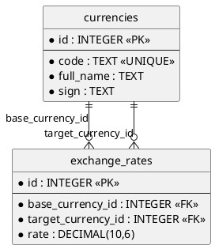

# ER-диаграмма системы «Обмен валют»

## ER-диаграмма



---

# Описание сущностей

## 1. Таблица currencies

Хранит информацию о валютах.

| Поле | Тип | Ограничения | Описание |
|------|------|-------------|----------|
| id | INTEGER | PRIMARY KEY AUTOINCREMENT | Идентификатор |
| code | TEXT | NOT NULL, UNIQUE | Код валюты |
| full_name | TEXT | NOT NULL | Полное название |
| sign | TEXT | NOT NULL | Символ валюты |

### Ограничения
- Код валюты должен быть уникальным
- Код валюты состоит из 3 символов

---

## 2. Таблица exchange_rates

Хранит курсы обмена валют.

| Поле | Тип | Ограничения | Описание |
|------|------|-------------|----------|
| id | INTEGER | PRIMARY KEY AUTOINCREMENT | Идентификатор |
| base_currency_id | INTEGER | FOREIGN KEY | Базовая валюта |
| target_currency_id | INTEGER | FOREIGN KEY | Целевая валюта |
| rate | DECIMAL(10,6) | NOT NULL | Курс обмена |

### Ограничения

```sql
FOREIGN KEY (base_currency_id)
REFERENCES currencies(id)
ON DELETE CASCADE

FOREIGN KEY (target_currency_id)
REFERENCES currencies(id)
ON DELETE CASCADE

UNIQUE(base_currency_id, target_currency_id)
```

---

# Связи между таблицами

- Одна валюта может участвовать во многих курсах
- Таблица exchange_rates содержит ссылки на currencies
- Связь реализована через внешние ключи

---

# Пример данных

## currencies

| id | code | full_name | sign |
|----|------|------------|------|
| 1 | USD | US Dollar | $ |
| 2 | EUR | Euro | € |
| 3 | RUB | Russian Ruble | ₽ |

---

## exchange_rates

| id | base_currency_id | target_currency_id | rate |
|----|------------------|-------------------|------|
| 1 | 1 | 2 | 0.920000 |
| 2 | 1 | 3 | 92.500000 |

---

# Почему используется DECIMAL

Для хранения денежных значений используется тип DECIMAL(10,6), так как FLOAT может давать ошибки округления при финансовых расчётах.

---

# Назначение ER-диаграммы

ER-диаграмма используется для:
- проектирования структуры базы данных
- определения связей между таблицами
- подготовки SQL-схемы
- проектирования REST API