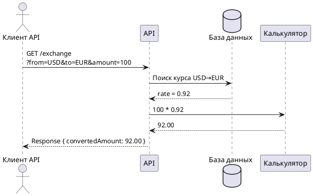
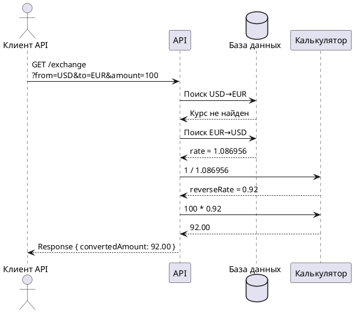
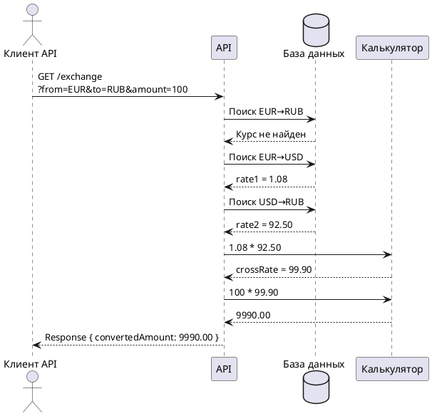

# Диаграмма последовательности: конвертация валюты

## Бизнес-процесс

Пользователь выполняет конвертацию суммы из одной валюты в другую через REST API.

---

# Сценарий 1: прямой курс

Курс USD → EUR существует в базе данных.



---

# Сценарий 2: обратный курс

Курс USD → EUR отсутствует, но существует EUR → USD.



---

# Сценарий 3: кросс-курс через USD

Прямой курс EUR → RUB отсутствует.
Используются курсы EUR → USD и USD → RUB.



---

# Почему используется DECIMAL

Для хранения денежных значений используется тип DECIMAL(10,6), так как тип FLOAT может давать ошибки округления.

Пример ошибки FLOAT:

```python
0.1 + 0.2
# 0.30000000000000004
```

Тип DECIMAL обеспечивает точность финансовых вычислений.

---

# Назначение диаграммы последовательности

Диаграмма последовательности используется для:
- описания бизнес-процессов
- отображения взаимодействия компонентов системы
- проектирования логики REST API
- документирования процесса конвертации валют