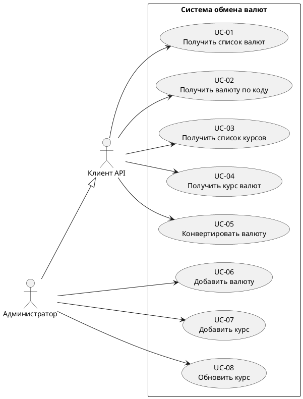

# Use-Case диаграмма системы «Обмен валют»

## Диаграмма вариантов использования

---

## Бизнес-правила

1. Код валюты состоит из 3 заглавных букв (USD, EUR, RUB)
2. Курс обмена является положительным числом
3. Каждая пара валют уникальна
4. Конвертация выполняется:
   - по прямому курсу
   - по обратному курсу
   - через кросс-курс USD

---

## Назначение диаграммы

Use-Case диаграмма показывает:
- кто взаимодействует с системой
- какие функции доступны
- какие операции реализует API

Документ используется для проектирования REST API системы обмена валют.